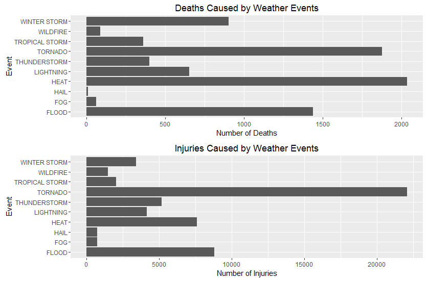
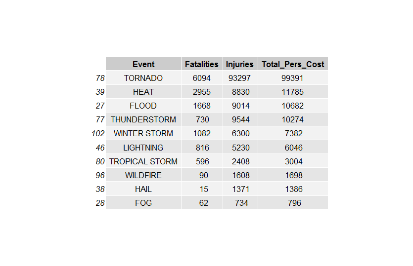
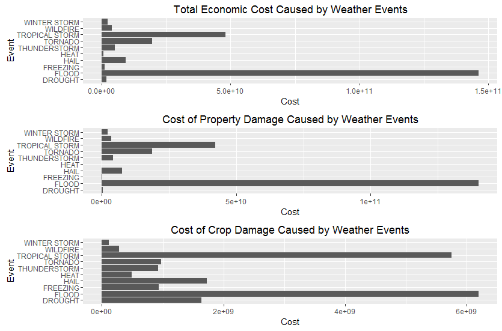
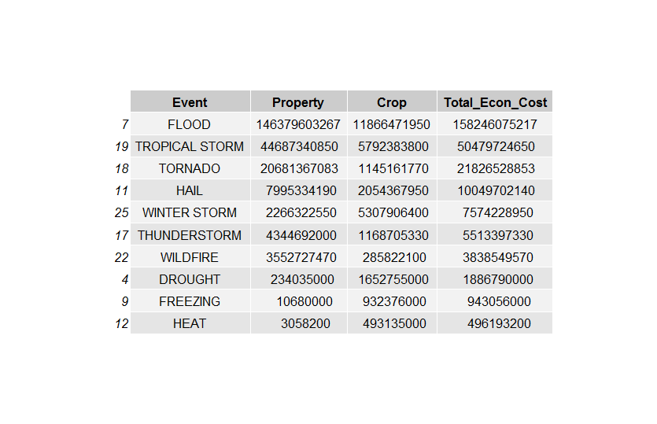

```{r setup, include=FALSE}
# load required libs
library(plyr, warn.conflicts = FALSE)
library(dplyr, warn.conflicts = FALSE)
library(ggplot2, warn.conflicts = FALSE)
library(knitr, warn.conflicts = FALSE)
library(stringr, warn.conflicts = FALSE)
library(gridExtra, warn.conflicts = FALSE)
library(grid, warn.conflicts = FALSE)

knitr::opts_chunk$set(echo=TRUE, message=FALSE, tidy=TRUE, comment=NA,
               cache=TRUE, fig.path="figure/", fig.keep="high",
               fig.width=10, fig.height=6,
               fig.align="center")

```

## Executive Summary

Data on severe weather in the United States is collected by the National Oceanic and Atmospheric Administration (NOAA) in the National Climatic Data Center (NCDC) Storm Events database.  The data includes severe weather events related to recorded public health (represented by deaths and/or injuries) and financial losses (represented by the economic cost of property and/or crop damage) recorded for the events.  Over the years, different events were added. Data from 1996 to present includes all 48 event types. 

For the project as the final assignment for the Coursera "Reproducible Research" course, the storm events data was imported, data from 1996 selected, tidied and events recoded.  The events were recoded due to inconsistent event names and typos in the EVTYPE field.  Property and crop cost were coded as powers of 10.  Powers of 10 are coded as letters representing exponents ("B" for billions or 9) but also as numbers 1 to 9. Total economic cost was calculated as the product of number of occurrences ("PROPDMG" or "CROPDMG") and the corresponding exponent ("PROPDMGEXP" or "CROPDMGEXP")    

After the recoding and tidying of data, tornadoes are the leading severe weather event causing 23,965 or 37% of the total fatalities and injuries since 1996.  Floods account for 10,221 or	16% and heat for 9,649 or 15% of the total fatalities and injuries since 1996.  The top 10 severe weather events, in decreasing order, are tornadoes, flood, heat, thunderstorm, lightning, winter storm, tropical storm, wildfire, fog and hail.

Severe weather event flooding is responsible for $146.3 billion or 62% of the property and crop damage since 1996.   The top 10 severe weather events, in decreasing order, are flood, tropical storm, tornado, hail, thunderstorm, wildfire, winter storm, drought, freezing and heat.


## Data Processing

### Data Source

As mentioned above, the severe weather data (https://d396qusza40orc.cloudfront.net/repdata/data/StormData.csv.bz2) is from NOAA's NCDC Storm Events database.  Descriptive documentation of the data and database can be found at National Weather Service Storm Events web page (https://www.ncdc.noaa.gov/stormevents/).  Details of the database are located at that page. Documentation (https://d396qusza40orc.cloudfront.net/repdata/peer2_doc/pd01016005curr.pdf) and National Climatic Data Center Storm Events FAQ (https://d396qusza40orc.cloudfront.net/repdata/peer2_doc/NCDC%20Storm%20Events-FAQ%20Page.pdf)

Reading the documentation and assignment requirements, only specific fields are needed to calculate health and economic effects.  Data since 1996 is more complete.

  - BGN_DATE (start of severe weather)
  - STATE (location)
  - EVTYPE (event type)
  - FATALITIES (no. of fatalities)
  - INJURIES (no. of injuries)
  - PROPDMG (damage cost on property)
  - PROPDMGEXP (factor codes 0-9, K, M, B, to be applied on PROPDMG)
  - CROPDMG (damage cost on crops)
  - CROPDMGEXP (factor codes 0-9, K, M, B, to be applied on CROPDMG)

The number of columns is reduced to from 37 to 9.

```{r eval=FALSE}
### download the file, if necessary
if (!file.exists("./data/repdata-data-StormData.csv.bz2"))
  download.file("https://d396qusza40orc.cloudfront.net/repdata%2Fdata%2FStormData.csv.bz2",
                "./data/repdata-data-StormData.csv.bz2")


### read in the dataset, if necessary
if (!exists("storm.data")){
  cat("Reading in the storm data file ... ")
  ## a bit pokey, takes 2 minutes to load
  ## 902,297 rows, 37 columns
  #not all columns are needed.  focus will be on:
  # state, beg_date, evtype, fatalaties, injuries,
  # propdmg, prodmgexp, cropdmg, cropdmgexp
  #  see http://stackoverflow.com/questions/5788117/only-read-limited-number-of-columns-in-r
  #columns from documentation are
  #STATE__,	BGN_DATE,	BGN_TIME,	TIME_ZONE,	COUNTY,	COUNTYNAME,	STATE,	EVTYPE,	BGN_RANGE,	BGN_AZI,	
  #BGN_LOCATI,	END_DATE,	END_TIME,	COUNTY_END,	COUNTYENDN,	END_RANGE,	END_AZI,	END_LOCATI,	LENGTH,	WIDTH,
  #F,	MAG,	FATALITIES,	INJURIES,	PROPDMG,	PROPDMGEXP,	CROPDMG,	CROPDMGEXP,	WFO,	STATEOFFIC,	ZONENAMES,
  # LATITUDE,	LONGITUDE,	LATITUDE_E,	LONGITUDE_,	REMARKS,	REFNUM
  
  # BGN_DATE (start of severe weather)
  # STATE 
  # EVTYPE (event type)
  # FATALITIES (no. of fatalities)
  # INJURIES (no. of injuries)
  # PROPDMG (damage cost on property)
  # PROPDMGEXP (factor codes K, M, B, to be applied on PROPDMG)
  # CROPDMG (damage cost on crops)
  # CROPDMGEXP (factor codes K, M, B, to be applied on CROPDMG)
  
  # using null prevents readin the column
  storm.data <- read.csv("./data/repdata-data-StormData.csv.bz2",
                         colClasses=c("NULL", 
                                      "character", #bgn_date
                                      rep("NULL",4),
                                      rep("character",2),  #state, evtype
                                      rep("NULL",14),  
                                      rep("numeric", 3), #fatalities, injuries, propdmg
                                      "character",  #propdmgexp
                                      "numeric",    #cropdmg
                                      "character",  #cropdmgexp
                                      rep("NULL",3),
                                      rep("NULL",2),  #latitude and #longitude, toogle on if needed
                                      rep("NULL",4)
                                      )
                        )
  cat("Storm data loaded!")
} 

## structure of data
str(storm.data)

#create a working copy for recovery if needed
storm.data.orig<-storm.data
```

### Tidying and re-coding the data

Since the full 48 weather events NOAA classifies as severe were not available until 1996, the data was limited to events since that year. This reduces the number of records to 653,530 records.

```r
storm.data$BGN_DATE<-year(mdy_hms(storm.data$BGN_DATE))
storm.data <- storm.data %>% filter(BGN_DATE >= 1996)
str(storm.data)
```
The next step is to tidy up the variable names and values in the EVTTYPE, PROPDMGEXP and CROPDMGEXP fields.  For the latter three fields, all values were converted to upper case (to be consistent), multiple spaces were removed as were leading and trailing spaces. 

```r
if(sum(grep("-",names(storm.data)))>0){
  names(storm.data) <- gsub("-", "_", names(storm.data)) 
}


## convert to upper case, remove multiple spaces and any preceding and trailing spaces
if (sum(!(grepl("^[[:upper:]]+$", storm.data$EVTYPE)))>0){
    storm.data$EVTYPE<-toupper(str_trim(gsub(pattern = "\\s\\s+", replacement = " ", storm.data$EVTYPE),side="both"))
}

if (sum(!(grepl("^[[:upper:]]+$", storm.data$PROPDMGEXP)))>0){
  storm.data$PROPDMGEXP<-toupper(str_trim(gsub(pattern = "\\s\\s+", replacement = " ", storm.data$PROPDMGEXP),side="both"))
}


if (sum(!(grepl("^[[:upper:]]+$", storm.data$CROPDMGEXP)))>0){
  storm.data$CROPDMGEXP<-toupper(str_trim(gsub(pattern = "\\s\\s+", replacement = " ", storm.data$CROPDMGEXP),side="both"))
}
```

Supposedly, the selection of allowable event names ("EVTYPE") was limited to a defined set of terms.  Some entries were misspelled ("THUDERSTORM") and others were abbreviated ("TSTM" for "THUNDERSTORM") or combined with other terms.  

```r
# Set event types with "Summary" or "Metro" to NA, as these are database errors 
storm.data$EVTYPE <- gsub("^SUMMARY.*|^METRO.*", NA, storm.data$EVTYPE)
#recast ?
storm.data$EVTYPE <- gsub("\\?", "Unknown", storm.data$EVTYPE)

#clean up messy names in events
storm.data[grep(".*FLOOD|RAIN|PRECIP|FLD|URBAN*.", storm.data$EVTYPE, perl=T),]$EVTYPE <-"FLOOD"
storm.data[grep(".*DROUGHT|DRY|HOT|HYPERTHERMIA|WARM|TEMPERATURE*.", storm.data$EVTYPE, perl=T),]$EVTYPE <-"DROUGHT"
storm.data[grep(".*TORNADO|ADO|SPOUT|FUNNEL|STRONG WIND|HIGH WIND|GUST|WHIRL*.", storm.data$EVTYPE, perl=T),]$EVTYPE <-"TORNADO"
storm.data[grep(".*WINTER|IC[EY]|SNOW|SLEET|BLIZZ|HYPO|THUNDERSNOW|COLD*.", storm.data$EVTYPE, perl=T),]$EVTYPE <-"WINTER STORM"
storm.data[grep(".*FIRE*.", storm.data$EVTYPE, perl=T),]$EVTYPE<-"WILDFIRE"
storm.data[grep(".*FREEZE|EXTREME COLD|EXTENDED COLD|COLD|CHILL*.", storm.data$EVTYPE, perl=T),]$EVTYPE<-"FREEZING"
storm.data[grep(".*THU[DN]|TSTM*.", storm.data$EVTYPE, perl=T),]$EVTYPE<-"THUNDERSTORM"
storm.data[grep(".*SURGE|TYPHOON|SURF|HURRI|TIDE|COAST|MARINE|SWELLS|SEA|REMNANTS|WAVE|TROPI*.", storm.data$EVTYPE, perl=T),]$EVTYPE<-"TROPICAL STORM"
storm.data[grep(".*HAIL*.", storm.data$EVTYPE, perl=T),]$EVTYPE<-"HAIL"
storm.data[grep(".*HEAT*.", storm.data$EVTYPE, perl=T),]$EVTYPE<-"HEAT"
storm.data[grep(".*SLIDE*.", storm.data$EVTYPE, perl=T),]$EVTYPE<-"LANDSLIDES"

```
The DMGEXP columns appear to be exponents of 10 to multiply against the value of the DMG fields.  The exponents are listed as 0-9 and H, K, M or B.  Following, is the interpretation of the values in these fields.

- 0: 10^0 or 1
- 1: 10^1 or 10
- H or h or 2: 10^2 or 100
- K or k or 3: 10^3 or 1,000
- 4: 10^4 or 10,000
- 5: 10^5 or 100,000
- M or m or 6: 10^6 or 1,000,000
- 7: 10^7 or 10,000,000
- 8: 10^8 or 100,000,000
- B or b or 9: 10^9 or 1,000,000,000

```r
#convert to char
storm.data$PROPDMGEXP <- as.character(storm.data$PROPDMGEXP)
storm.data$CROPDMGEXP <- as.character(storm.data$CROPDMGEXP)


storm.data$PROPDMGEXP[(storm.data$PROPDMGEXP)=="B"]<- 9
storm.data$CROPDMGEXP[(storm.data$CROPDMGEXP)=="B"]<- 9

storm.data$PROPDMGEXP[(storm.data$PROPDMGEXP)=="M"]<- 6
storm.data$CROPDMGEXP[(storm.data$CROPDMGEXP)=="M"]<- 6

storm.data$PROPDMGEXP[(storm.data$PROPDMGEXP)=="K"]<- 3
storm.data$CROPDMGEXP[(storm.data$CROPDMGEXP)=="K"]<- 3

storm.data$PROPDMGEXP[(storm.data$PROPDMGEXP)=="H"]<- 2
storm.data$CROPDMGEXP[(storm.data$CROPDMGEXP)=="H"]<- 2

#back to numeric
storm.data$PROPDMGEXP <- as.numeric(storm.data$PROPDMGEXP)
storm.data$CROPDMGEXP <- as.numeric(storm.data$CROPDMGEXP)
```

Any records with missing data are then removed.

```r
#check for missing data and remove any
if(sum(is.na(storm.data))>0){
  storm.data <- storm.data[complete.cases(storm.data), ]
}
```
### Personal Costs

Deaths and injuries are aggregated by severe weather event type.

```r
pers<-aggregate(cbind(storm.data$FATALITIES, storm.data$INJURIES)~storm.data$EVTYPE, data=storm.data, FUN=sum, na.rm=TRUE)
names(pers) =c("Event","Fatalities","Injuries")
pers2<-pers[!with(pers,Fatalities==0 & Injuries==0),]
pers2$Total_Pers_Cost<-pers2$Fatalities + pers2$Injuries

#select top 10
pers2<-pers2[ order(-pers2[,4], pers2[,1]), ]
pers2.top <- pers2[1:10,]
```

Graphs for the deaths and injuries are created.

```r
dth <- ggplot(pers2.top, aes(x=Event,y=Fatalities )) + 
  geom_bar(stat="identity") + coord_flip() + 
  labs(title="Deaths Caused by Weather Events", x = "Event", y="Number of Deaths")
print(dth)

inj <- ggplot(pers2.top, aes(x=Event,y=Injuries )) + 
  geom_bar(stat="identity") + coord_flip() + 
  labs(title="Injuries Caused by Weather Events", x = "Event", y="Number of Injuries")
print(inj)

grid.arrange(dth, inj, nrow=2)
```
### Economic Costs

The product of the DMG columns and DMGEXP columns is then calculted to yield the severe weather event's economic cost.
```r
#create new vars to costs (DMG*10^DMGEP)
storm.data$PROPCOST <- storm.data$PROPDMG*10^storm.data$PROPDMGEXP
storm.data$CROPCOST <- storm.data$CROPDMG*10^storm.data$CROPDMGEXP
```

Property and crop costs are then aggregated by event, records with 0 for both crop and property expense are removed and a total economic cost column added.

```r
#which events had fatalities, injuries, crop or property damage and crop or property expense
#calculate the sum for property and crop costs by event
econ<-aggregate(cbind(storm.data$PROPCOST, storm.data$CROPCOST)~storm.data$EVTYPE, data=storm.data, FUN=sum, na.rm=TRUE)

#more friendly names
names(econ) =c("Event","Property","Crop")

#remove records where porperty and crop damage is zero
econ2<-econ[!with(econ,Property==0.000000e+00 & Crop==0),]
str(econ2)

#sum to get total economic cost
econ2$Total_Econ_Cost<-econ2$Property + econ2$Crop
#sort from high to low
econ2<-econ2[ order(-econ2[,4], econ2[,1]), ][1:10,]
#do running total
econ2 %>% group_by(Event) %>% mutate(cumsum = cumsum(Total_Econ_Cost))
```

The top 10 values for each loss class by event are extracted.
```r
#extract property and crop damage
prop2<-econ2[ order(-econ2[,2], econ2[,1]), ][1:10,]
crop2<-econ2[ order(-econ2[,3], econ2[,1]), ][1:10,]
```

Graphs for total economic cost and the individual property classes are created.

```r
#plot total economic cost
totl <- ggplot(econ2, aes(x=Event,y=Total_Econ_Cost )) + 
  geom_bar(stat="identity") + coord_flip() + 
  labs(title="Total Economic Cost Caused by Weather Events", x = "Event", y="Cost")
print(totl)

#plot property costs
prop <- ggplot(prop2, aes(x=Event,y=Property )) + 
  geom_bar(stat="identity") + coord_flip() + 
  labs(title="Cost of Property Damage Caused by Weather Events", x = "Event", y="Cost")
print(prop)

#plot crop costs
crop <- ggplot(crop2, aes(x=Event,y=Crop )) + 
  geom_bar(stat="identity") + coord_flip() + 
  labs(title="Cost of Crop Damage Caused by Weather Events", x = "Event", y="Cost")
print(crop)

grid.arrange(totl,prop, crop, nrow=3)
```

## Results

Severe storms have effects on people (deaths and injuries) and property and crops.  The following sections show effects of the top 10 events on people and the economy.

### Personal Costs

Tornadoes are the leading severe weather event causing the 23,965 or 37% of the total fatalities and injuries since 1996.  Floods account for 10,221 or	16% and heat for 9,649 or 15% of the total fatalities and injuries since 1996.  The top 10 severe weather events, in decreasing order, are tornadoes, flood, heat, thunderstorm, lightning, winter storm, tropical storm, wildfire, fog and hail.

The following graphs show fatalities and injuries for the top 10 severe weather events.  Considering fatalities and injuries separately, the leading cause of fatalities is heat at 26% of the total number of deaths, followed by tornados at 24% and floods at 18%. For injuries alone, tornadoes are the leading events at 39% with floods at 16% and heat at 14%.

#### Figure 1:  Graph of personal costs (deaths and injuries) of severe weather events,


The following table shows, in decreasing order, fatalaties and injuries by severe weather events.  Of the total number of injuries and deaths, injuries account for 88% and deaths 12%.

#### Table 1:  Top 10 weather events causing deaths or fatalities



### Economic Costs

Severe weather events cause damage to agriculture.  Severe weather event flooding is responsible for $146.3 billion or 62% of the property and crop damage since 1996.   The top 10 severe weather events, in decreasing order, are flood, tropical storm, tornado, hail, thunderstorm, wildfire, winter storm, drought, freezing and heat.

The top 10 severe weather events are shown in the following graphs and table.  

#### Figure 2:  Graph of economic costs (property and crop losses) of severe weather events,


For total economic cost, losses due to flooding accounts for 62% of the total $237.6 billion since 1996.  The second event, tropical storms, accounts for 20%.  Looking at each class of loss separately, there are differences in order and contribution.  For property, the values are quite similar to the total economic loss with floods accounting for 64% and tropical storms for 19%.  Property losses account for 92% of the total losses.

Crop losses account for 8% of the total losses.  Floods account for 33% of these losses and tropical storms 30%. Hail and drought are both 9% of the total crop losses,

#### Table 2:  Top 10 weather events causing deaths or fatalities


## System Information

The analysis was run with the following software and hardware.

```{r}
sessionInfo()
```

The source code for this document and the analysis is stored in GitHub at: 
https://github.com/wer61537/Servere_Weather_Events